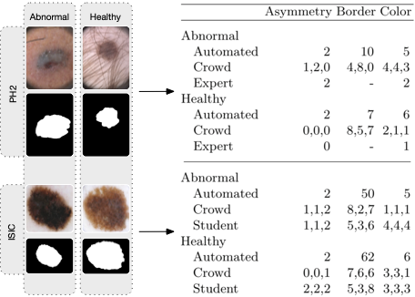

# ENHANCE

We present **ENHANCE** (**EN**riching **H**ealth data by **AN**notations of **C**rowd and **E**xperts), an open dataset with multiple annotations to complement the existing ISIC [1] and PH2 [2] skin lesion classification datasets. The dataset contains annotations of visual ABC (asymmetry, border, color) features from non-expert annotation sources: undergraduate students, crowd workers from Amazon MTurk and classic image processing algorithms.

The following figure illustrates the acquired annotations. The left part shows examples of skin lesions and corresponding masks (black-white image). The top two lesions are from the PH2 dataset; the bottom two are from the ISIC dataset. The right part shows examples of scores from different annotation sources are also given. The student and crowd annotations show that at least three different annotators assessed each image.

Following table summarises the number of collected annotations for each annotation source and type:

|           |           | ISIC | PH2 |
|-----------|-----------|------|-----|
| Automated |           |      |     |
|           | Asymmetry | 1970 | 165 |
|           | Border    | 1996 | 0   |
|           | Color     | 2000 | 200 |
| Crowd     |           |      |     |
|           | Asymmetry | 1250 | 200 |
|           | Border    | 1250 | 200 |
|           | Color     | 1250 | 200 |
| Student   |           |      |     |
|           | Asymmetry | 1631 | 0   |
|           | Border    | 1631 | 0   |
|           | Color     | 1631 | 0   |
          

Here is a description of the repository structure and files:
- 0_data: contains the collected annotations of visual features and example skin lesion images in four subfolders:
  - automated: contains annotations of visual ABC features from classic image processing algorithms
  - crowd: contains annotations of visual ABC features from crowd workers from Amazon MTurk
  - external: contains example skin lesion images and a ground truth file (ISIC 2017 dataset) used for training the CNN architectures (located in 1_code)  
  - student: contains annotations of visual ABC features from undergraduate students of three years (2017-2018, 2018-2019, and 2019-2020)
- 1_code: contains the baseline and multi-task models used based on three different CNN architectures (VGG-16, Inception v3, and ResNet50).

For more detailed information, please read the readme-files in the various folders.

---
1. Codella, N.C., Gutman, D., Celebi, M.E., Helba, B., Marchetti, M.A., Dusza, S.W., Kalloo, A., Liopyris, K., Mishra, N., Kittler, H., et al.: Skin lesion analysis toward melanoma detection: A challenge at the 2017 International Symposium on Biomedical Imaging (ISBI), hosted by the International Skin Imaging Collaboration (ISIC). arXiv preprint arXiv:1710.05006 (2017)

2. Mendonca, T.F., Celebi, M.E., Mendonca, T., Marques, J.S.: Ph2: A public database for the analysis of dermoscopic images. Dermoscopy image analysis (2015)

